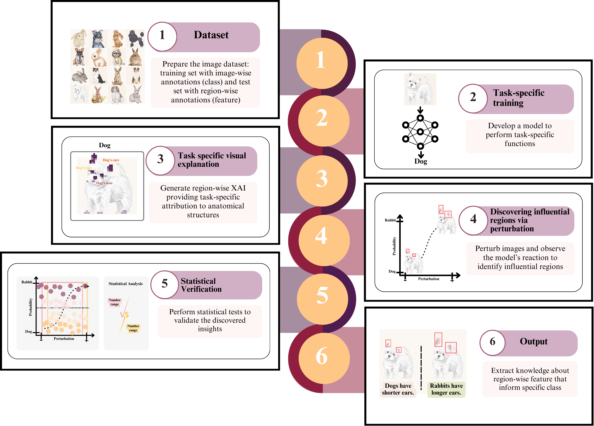

# Knowledge XAIeve: A framework for discovering knowledge in panoramic radiographs through task-specific explainable AI and sample perturbation techniques---A Case Study of the Thai Population Aged 7–25

[Natthanich Hirunchavarod](https://github.com/nattntn), [Natnicha Sributsayakarn](https://www.phyathai.com/en/pyt2/doctor/d-d-s-natnicha-sributsayakarn), [Suchaya Pornprasertsuk-Damrongsri](https://murex.mahidol.ac.th/en/persons/suchaya-pornprasertsuk-damrongsri/), [Varangkanar Jirarattanasopha](https://dt.mahidol.ac.th/language/en/menu-personnel/varangkanar-jirarattanasopha-en/), [Thanapong Intharah](https://vi-lab-th.github.io)

> Abstract: We present Knowledge XAIeve, a framework for  discovering knowledge from convolutional neural  network (CNN) models trained on panoramic  radiographs, translating a model's internal  reasoning into explicit, testable hypotheses. 
The framework operates through five stages: (1) preparing the dataset, (2) training a  task-specific CNN model, (3) applying global  explainability to localize influential semantic  regions, (4) performing systematic perturbation  to quantify their influence, and (5) statistically  validating the resulting patterns using linear mixed-effects models.
We demonstrated its application using 5,132 panoramic radiographs from 2,778 Thai patients aged 7-25 years across two scenarios: sex classification (accuracy 87.38\%, sensitivity 87.61\%, specificity 87.16\%) and age estimation (RMSE 1.96 years). 
The framework reaffirmed the lower third molar as the primary predictor for age estimation, revealing a nonlinear, sex-dependent relationship between the crown--root ratio and predicted age ($p$ < 0.001), and reaffirmed the upper canine while discovering upper third molar as key predictors for male and female sex classification, respectively ($p$ < 0.001). 
Follow-up validation confirmed that sexual dimorphism in the upper third molar is driven primarily by root rather than crown dimensions.
These findings demonstrate the potential of Knowledge XAIeve for generating novel, biologically grounded hypotheses from CNN models trained on panoramic radiographs.

## Method Overview

**Figure 1.** Overview of the proposed framework for discovering knowledge from a trained AI model.
The process begins with (1) preparing the dataset, followed by (2) developing a CNN model for task-specific functions.
(3) Domain-specific visual explanations are generated for each prediction, and (4) salient regions are perturbed to assess their impact on model outputs. 
(5) Statistical tests are then applied to validate the results, producing (6) verified, human-interpretable knowledge. 


## :mega: News
- [2027.7.31] Release a demo on [Colab]()

- 
## Contents
- [Install](#install)
- [Dataset](#dataset)
- [Task-specific training](#model)
- [Task specific visual explanation](#opg-shap)
- [Discovering influential regions via perturbation](#perturbation)
- [Statistical Verification](#statistic)

## Getting Started

### :hammer_and_wrench: Environment Installation <a href="#install" id="install"/>
```
git clone --recurse-submodules https://github.com/nattntn/Knowledge_XAIeve.git
```

### :open_file_folder: Dataset <a href="#dataset" id="dataset"/>


### :octocat: Task-specific training <a href="#model" id="model"/>
The predictive backbone is **DeepToothDuo**, which utilizes an EfficientNetB0
architecture pre-trained on ImageNet and fine-tuned for two tasks from panoramic radiographs.

| Task | Metric | Result | 95% CI |
|:---:|:---:|:---:|:---:|
| Age estimation | RMSE | 1.96 years | — |
| Sex classification | Accuracy | 87.38% | 85.1–89.3% |
| Sex classification | Sensitivity | 87.61% | 84.3–90.3% |
| Sex classification | Specificity | 87.16% | 83.8–89.9% |

**BibTeX:**
```
@inproceedings{hirunchavarod2024deeptoothduo,
  title={Deeptoothduo: Multi-task age-sex estimation and understanding via panoramic radiograph},
  author={Hirunchavarod, Natthanich and Phuphatham, Pornnakanok and Sributsayakarn, Natnicha and Prathansap, Narawit and Pornprasertsuk-Damrongsri, Suchaya and Jirarattanasopha, Varangkanar and Intharah, Thanapong},
  booktitle={2024 IEEE International Symposium on Biomedical Imaging (ISBI)},
  pages={1--5},
  year={2024},
  organization={IEEE}
}
```

### :loop: Task specific visual explanation <a href="#opg-shap" id="opg-shap"/>
This stage runs OPG-SHAP over the full test set, to highlight what regions the model finds important for each prediction.

> OPG-SHAP is an explainable AI tool designed to interpret deep learning models used on panoramic radiographs.
It combines YOLO object detection and SHAP (SHapley Additive exPlanations) values to automatically highlight the specific dental regions (out of 20 predefined anatomical regions) that influence an AI model's prediction.

```
@inproceedings{hirunchavarod2024opg,
  title={Opg-shap: A dental ai tool for explaining learned orthopantomogram image recognition},
  author={Hirunchavarod, Natthanich and Dangsungnoen, Lapatrada and Thongprasant, Kwansawan and Phuphatham, Pornnakanok and Prathansap, Narawit and Sributsayakarn, Natnicha and Pornprasertsuk-Damrongsri, Suchaya and Jirarattanasopha, Varangkanar and Intharah, Thanapong},
  booktitle={2024 International Technical Conference on Circuits/Systems, Computers, and Communications (ITC-CSCC)},
  pages={1--6},
  year={2024},
  organization={IEEE}
}
```

### :bulb: Discovering influential regions via perturbation <a href="#perturbation" id="perturbation"/>


### :bar_chart: Statistical Verification <a href="#statistic" id="statistic"/>
